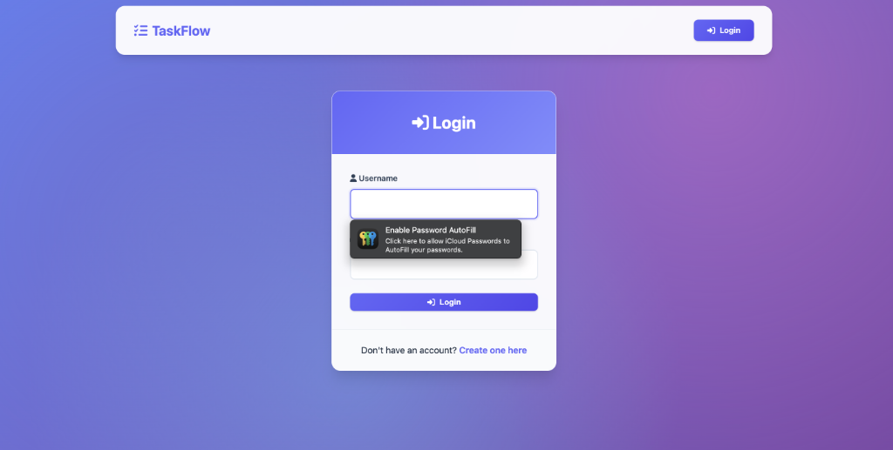
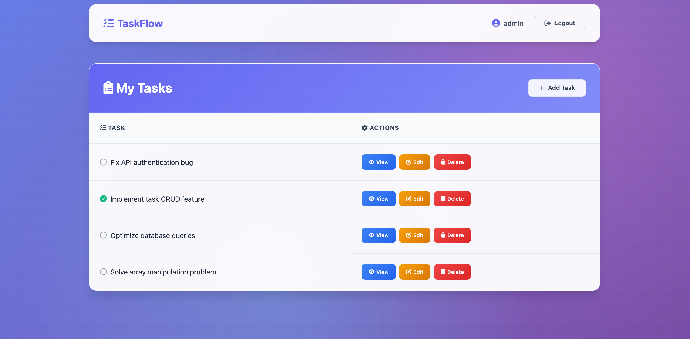
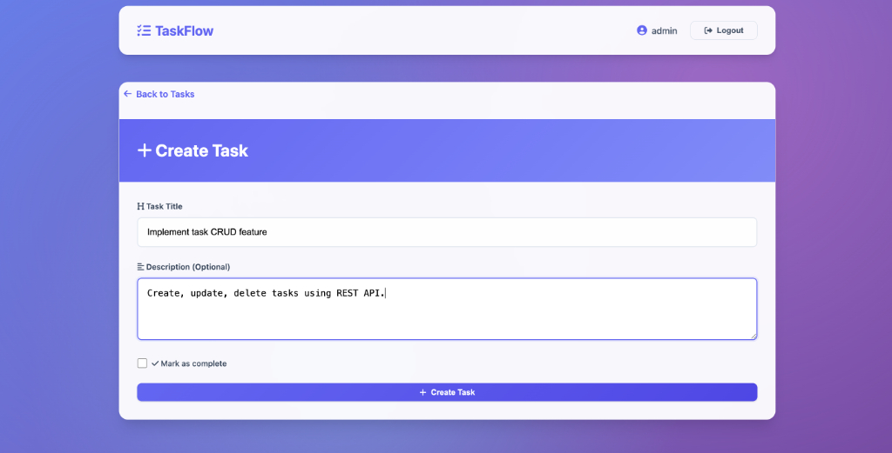
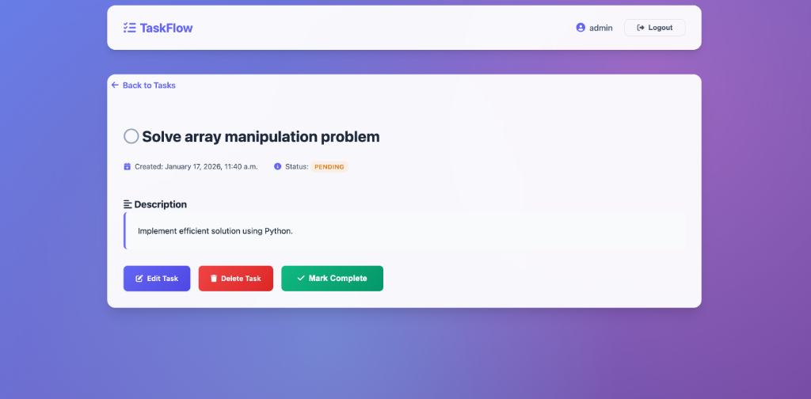
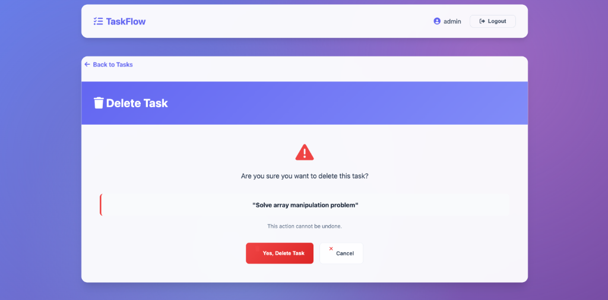

<div align="center">

# ✨ TaskFlow

### Your Personal Task Management Companion

[](https://www.djangoproject.com/)
[](https://www.python.org/)
[](https://www.sqlite.org/)
[](LICENSE)

<p align="center">
  <strong>A robust and elegant Task Management System built with Django</strong><br>
  Stay organized, boost productivity, and never miss a deadline again.
</p>

[Features](#-features) •
[Screenshots](#-screenshots) •
[Installation](#-installation--setup) •
[Tech Stack](#-tech-stack) •
[Project Structure](#-project-structure)

---

</div>

## 🎯 Overview

**TaskFlow** is a beautifully crafted task management application that helps you organize your daily workflow with ease. Built with Django's powerful backend capabilities, it offers a clean, intuitive interface where every user gets their personalized dashboard to manage tasks efficiently.

<br>

## ✨ Features

<table>
<tr>
<td width="50%">

### 🔐 Authentication
- Secure user registration
- Protected login system
- Safe logout functionality
- Session management

</td>
<td width="50%">

### 📋 Task Management
- ➕ Create tasks with titles & descriptions
- 👁️ View pending & completed tasks
- ✏️ Edit task details anytime
- 🗑️ Delete unwanted tasks

</td>
</tr>
<tr>
<td width="50%">

### 🎨 User Experience
- Clean, minimalist design
- Responsive interface
- Intuitive navigation
- Status indicators

</td>
<td width="50%">

### 🔍 Smart Features
- Personalized dashboard
- Data privacy ensured

</td>
</tr>
</table>

<br>

## 📸 Screenshots

<div align="center">

### 🔑 Login Page
*Secure entry point for users*



---

### 📊 Task Dashboard
*Overview of all tasks with status indicators*



---

### ➕ Create Task
*Add new tasks quickly and easily*



---

### 📝 Task Details
*View and edit specific task information*



---

### ⚠️ Delete Confirmation
*Safety check before removing a task*



</div>

<br>

## 🛠️ Tech Stack

<div align="center">

| Technology | Description |
|:----------:|:------------|
|  | Backend Framework (v5.2.4) |
|  | Programming Language (3.10+) |
|  | Database (easily switchable) |
|  | Markup Language |
|  | Styling |

</div>

<br>

## 🚀 Installation & Setup

### Prerequisites

Before you begin, ensure you have the following installed:

- ✅ **Python 3.10+** - [Download here](https://www.python.org/downloads/)
- ✅ **Git** - [Download here](https://git-scm.com/downloads)

### Quick Start

**1️⃣ Clone the Repository**

```bash
git clone <repository-url>
cd todo_list
```

**2️⃣ Create Virtual Environment**

```bash
# Create virtual environment
python -m venv .venv

# Activate on Mac/Linux
source .venv/bin/activate

# Activate on Windows
.venv\Scripts\activate
```

**3️⃣ Install Dependencies**

```bash
pip install -r requirements.txt
```

**4️⃣ Database Setup**

```bash
# Apply migrations
python manage.py migrate

# Create admin user (optional)
python manage.py createsuperuser
```

**5️⃣ Launch Application**

```bash
python manage.py runserver
```

<div align="center">

🎉 **Open your browser and visit:** `http://127.0.0.1:8000/`

</div>

<br>

## 📁 Project Structure

```
todo_list/
│
├── 📂 base/                    # Core application
│   ├── 📂 migrations/          # Database migrations
│   ├── 📂 templates/base/      # HTML templates
│   │   ├── login.html
│   │   ├── register.html
│   │   ├── task_list.html
│   │   └── ...
│   ├── 📄 models.py            # Database models
│   ├── 📄 views.py             # Application logic
│   ├── 📄 urls.py              # URL routing
│   └── 📄 admin.py             # Admin configuration
│
├── 📂 todo_list/               # Project configuration
│   ├── 📄 settings.py          # Global settings
│   ├── 📄 urls.py              # Main URL routing
│   └── 📄 wsgi.py              # WSGI configuration
│
├── 📂 screenshots/             # README images
├── 📄 db.sqlite3               # SQLite database
├── 📄 manage.py                # Django CLI utility
├── 📄 requirements.txt         # Dependencies
└── 📄 README.md                # Documentation
```

<br>

## 🤝 Contributing

Contributions are what make the open-source community amazing! Any contributions you make are **greatly appreciated**.

1. Fork the Project
2. Create your Feature Branch (`git checkout -b feature/AmazingFeature`)
3. Commit your Changes (`git commit -m 'Add some AmazingFeature'`)
4. Push to the Branch (`git push origin feature/AmazingFeature`)
5. Open a Pull Request

<br>


---

<div align="center">

**Made with ❤️ and Django**

⭐ Star this repo if you find it helpful!

</div>